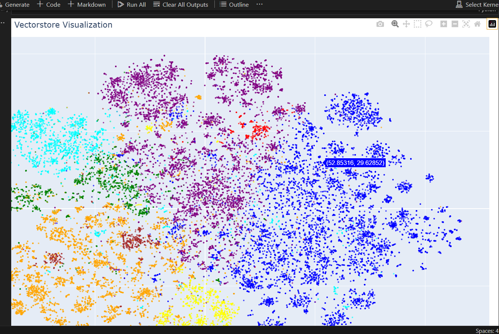
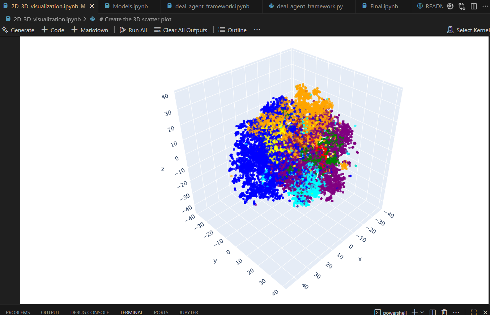
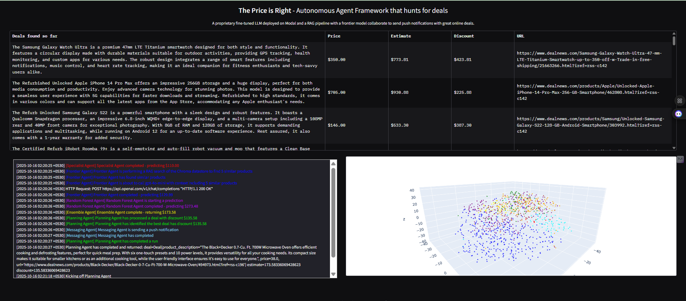
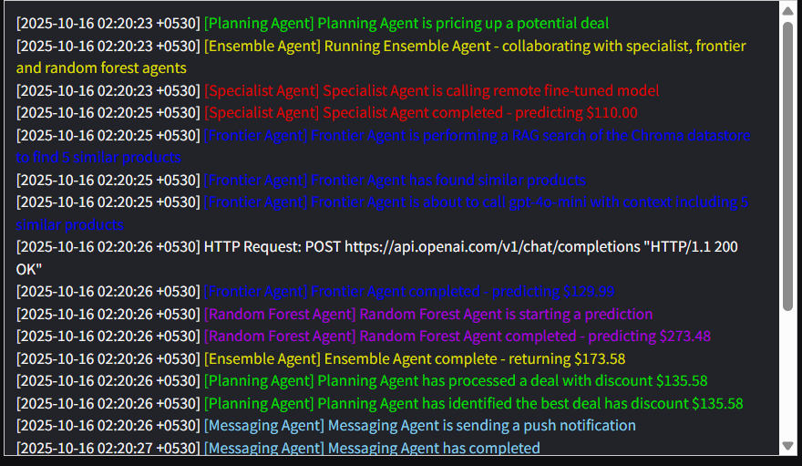
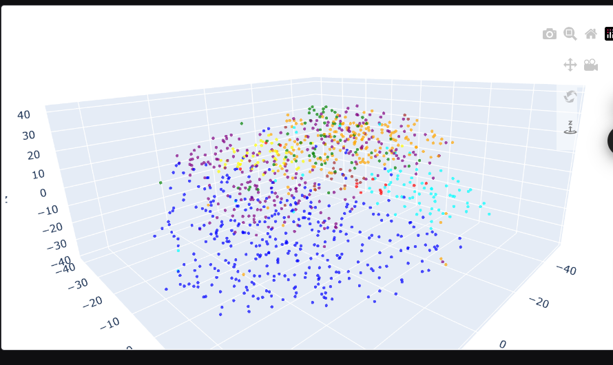

# agentic-ai-deal-hunter

**A Complete AI-Powered Price Intelligence System — Built by Me**

---

##  Overview

**The Price is Right** is my personal end-to-end AI project where I built a complete system that can understand products, predict their prices, find online deals, and even send live notifications about the best offers — all from scratch.

This project combines multiple AI components — embeddings, retrieval, machine learning, and autonomous agents — to create an intelligent price-prediction and deal-monitoring ecosystem that I developed and refined entirely myself.

---

##  What This System Does

1. **Understands product descriptions** by converting text into embeddings (numerical meaning vectors).
2. **Stores and retrieves** those vectors in a local vector database that I built and optimized.
3. **Predicts product prices** using multiple methods I designed — semantic retrieval, pattern-based machine learning, and ensemble learning.
4. **Visualizes embeddings** in 2D and 3D to show how different product categories cluster.
5. **Scans live product deals**, analyzes them, and selects only the best ones.
6. **Sends notifications** directly to my device when good deals appear.
7. **Displays everything** in a live interactive dashboard that updates automatically.

---

##  My Project Structure

This is the exact layout of my local project folder:

* `.venv/` — virtual environment.
* `agents/` — contains all the agents I built (scanner, messenger, planner, ensemble coordinator, etc.).
* `myenv/` — another isolated environment I used during experiments.
* `products_vectorstore/` — my own persistent vector database where all embeddings are stored.
* `.env` — environment variables and tokens (private, not shared).
* `Modal_Setup_and_Deployment.ipynb` — my initial setup where I configured cloud execution and tested deployments.
* `vectorstore.ipynb` — where I built my vector database from product data.
* `2D_3D_visualization.ipynb` — notebook for generating 2D and 3D visualizations of product embeddings.
* `Models.ipynb` — experiments with regression, Random Forest, and ensemble models.
* `Final.ipynb` — main notebook that merges all models and agents.
* `deal_agent_framework.ipynb` and `.py` — the framework I developed that controls scanning, messaging, and planning agents.
* `price_is_right_final.py` — the final running version of my dashboard.
* `items.py` — defines my product data structure.
* `testing.py` — test and evaluation helper scripts.
* `requirements.txt` — libraries required to run my setup.
* `train.pkl` / `test.pkl` — training and testing datasets.
* `ensemble_model.pkl`, `random_forest_model.pkl` — my trained models saved for reuse.
* `products_vectorstore/` — my saved embeddings.

---

##  Project Flow (Designed and Built by Me)

```
[Raw Product Data]
       ↓
[Text Cleaning & Preprocessing]
       ↓
[Embedding Generation (Understanding Meaning)]
       ↓
[Vector Database Storage]
       ↓
+----------------------------+
|                            |
↓                            ↓
[Retrieval System]     [ML Price Predictor]
  ↓                            ↓
   \                          /
    \                        /
     ↓                      ↓
          [Ensemble Layer]
               ↓
        [Final Price Prediction]
               ↓
  [Autonomous Agents: Scanner → Planner → Messenger]
               ↓
      [Interactive Dashboard]
```

### Step-by-Step Explanation

1. **Data Preparation** — I started with thousands of real-world product descriptions and prices. I cleaned and formatted them to create consistent input.
2. **Embeddings** — I transformed text into 384-dimensional embeddings that capture meaning and similarity.
3. **Vector Database** — I designed a local storage structure (vectorstore) to save and query embeddings efficiently.
4. **Retrieval & Similarity Search** — For any new product, my system finds the most similar items and uses them as reference for predicting prices.
5. **Model Training** — I trained a Random Forest model and integrated it with my retrieval approach to build a hybrid system.
6. **Ensemble Model** — I combined multiple prediction sources (retrieval, Random Forest, and a rule-based expert model) to form a balanced price estimator.
7. **Autonomous Agents** — I developed a small framework of agents:

   * **Scanning Agent** — constantly searches for new product deals.
   * **Planning Agent** — decides which deals are worth attention.
   * **Messaging Agent** — automatically sends me push notifications for the best ones.
8. **Dashboard Interface** — I designed an interactive UI using Gradio that shows live results, logs, and a 3D product embedding plot.

---

## Pushover Integration (My Notification System)

To make the project interactive and practical, I integrated my notification system using Pushover. I set up and configured everything myself.

**How it works in my system:**

* My agents automatically identify new deals.
* When an important deal appears, the Messaging Agent triggers a push notification.
* The message includes the product name, price, and link so I can check it immediately.

**Testing and setup:**

* I created my own developer account, generated my keys, and stored them safely in `.env`.
* I tested each notification step by sending manual alerts from the dashboard.
* The alerts arrive on my phone within seconds, showing that my backend logic is working perfectly.

This feature gives my system a real-time, personal touch — it’s like having a smart assistant that texts me when something worth buying appears.

---

##  Visualization (2D and 3D)

I visualized my product embeddings to understand how similar products group together. Each point on the scatter represents a product. Points of similar categories (like Electronics, Appliances, Toys) naturally cluster together.

This step gave me deep insights into how my AI “sees” different product types. It helped me verify that my embeddings were working properly and capturing real meaning from product descriptions.

### 🌀 2D Visualization
[](https://github.com/Suyash84270/agentic-ai-deal-hunter/blob/main/screenshots/2D.png?raw=true)

---

### 🌍 3D Visualization
[](https://github.com/Suyash84270/agentic-ai-deal-hunter/blob/main/screenshots/3D.png?raw=true)


##  How My AI Thinks

When my AI predicts a price, it does not just guess. Here’s how it reasons step by step:

1. **Understands** the input text and extracts meaning.
2. **Finds** similar items in my vector database.
3. **Compares** them and learns from the nearest ones.
4. **Predicts** an estimated price using both logic (ML model) and similarity context.
5. **Balances** multiple predictions to get a final answer.

This multi-step reasoning process makes my AI consistent and intelligent — it learns from examples like a human would.

---

##  Dashboard Flow (My Gradio App)

My Gradio dashboard acts as the main control center for everything. When I run the app:

* It launches an interactive web interface with three live sections:

  * **Top Section:** Current deals and their predicted prices.
  * **Middle Section:** Live logs from my agents showing what’s happening in real-time.
  * **Bottom Section:** A 3D embedding visualization of products.
* It automatically refreshes every few minutes, scans again, and notifies me about any new updates.

The dashboard feels alive — I can see my system thinking, retrieving, and predicting continuously.

### 🧠 Gradio App UI
[](https://github.com/Suyash84270/agentic-ai-deal-hunter/blob/main/screenshots/gradio_full.png?raw=true)

### 🤖 Agent Flow
[](https://github.com/Suyash84270/agentic-ai-deal-hunter/blob/main/screenshots/gradio_agent_flow.png?raw=true)

### 🌐 3D Visualization
[](https://github.com/Suyash84270/agentic-ai-deal-hunter/blob/main/screenshots/gradio_visualization.png?raw=true)


### Why I Built It

I wanted to create something that doesn’t just use AI passively but *acts* on its own — an autonomous system that thinks, learns, and communicates. This project was my way of connecting multiple AI concepts: retrieval, machine learning, visualization, and automation.

### What I Learned

* How to combine deep learning and traditional ML into a working hybrid pipeline.
* How embeddings work and how to build and query a vector database.
* How to visualize high-dimensional data and interpret clustering.
* How to automate end-to-end systems that can make decisions independently.
* How to design an AI framework that’s modular and expandable.

### What Makes This Project Special

This project is 100% built by me — from data preparation to model training, agent creation, UI design, and deployment.  Every part of it is hand-crafted and fine-tuned to work smoothly together.


---

##  Modal Model Deployment (Backend API)

The fine-tuned model is deployed on **[Modal Cloud](https://modal.com/apps/suyashshastri2227/main/ap-eZkAGJNvezZmJjKVxeAhSM?start=1760510503.243&end=1760596903.243&live=true&activeTab=functions&functionId=fu-WPjFbfG8742ae6IzZvITnH&functionSection=calls&limit=100&includeLogContext=false)** as a serverless backend service.

###  Functionality
- The model is hosted on Modal for **on-demand predictions**.  
- It runs in the cloud using lightweight containers — no need to keep a local server running.  
- The deployed Modal function pricer can be called directly from Python or other agents.

###  Example Usage
```python
import modal

stub = modal.Stub("pricer-service")

@stub.function()
def price(features: dict):
    # returns model predictions
    ...


## Finally

This project is my personal achievement in combining multiple areas of AI — data processing, vector search, model training, visualization, and intelligent automation — into one unified system that actually works in real-time.

It’s not just a model — it’s a living AI assistant that watches prices, learns patterns, and interacts with me directly.

I’m proud of how everything connects — from the raw data to the 3D visualization and final notifications on my phone.

This project taught me how to think like an AI engineer, a data scientist, and a system designer all at once. 
